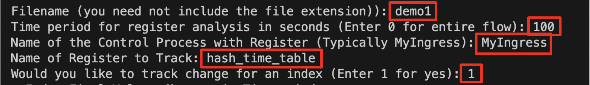

## Background
This project was created as as assignment for Harvard College's CS 145 \(Networking at Scale\) by Dr. Minlan Yu. 

This project contains an implementation for an assistive tool that help with development with P4. The tool has the capabilities to parse log files and visualize/present changes that happen in registers over the course of time. It can output both the final register values after `k` seconds of running a flow and the corresponding change of values for any index of the register in the first `k` seconds. 

I added the ability to partially parse log files by time periods due to the following reasons: \n
1) The change in values of registers can be very quick with registers being updated every few milliseconds in some scenarios. For instance, some of the generated log files for switches 1 and 6 exceeded 2 Gbs in Project 6 of this class. For those sizes, even my text-editor (VS-Code) struggles to smoothly load and traverse through the files. Also, that was only for a 300 second udp flow, the size would be even larger for larger flow times.

2) When looking for factors such as convergence, I felt it would be convenient to analyze and study the change in values of registers in different time periods. This debugging tool gives out the number of times an index was updated in a given time period to assist with detecting frequency of access. This could again be helpful in debugging Project 6 and finding the optimal values of factors such as `enqq_depth_threshold` by observing frequency of change in the random seed.

### Dependencies
The debugger is built in python and uses pandas and matplotlib to generate the register pngs/csvs. I would recommend having Python 3.9.12 or higher along with pandas and matplotlib installed.

## Functionality

### Some Preliminaries
1. Here are some values for the inputs that the programs asks for, which will work with the given demo files: 

Demo Name |  Filename | Time Period | Control Process | Register Name | Would You like to Track Index
:-------------:|:-------------:|:------------:|:-------------:|:----:|:-------:
1 | demo1 | 0-3599 | MyIngress | hash_time_table, hash_flow_table | if yes: 1
2 | demo2 | 0-3599 | MyIngress | hash_time_table, hash_flow_table, someimp_table | if yes: 1
3 | demo3 | 0-3599 | MyIngress | someimp_table | if yes: 1
large | demo_large | 1-3599 | MyEgress | clone_timestamp | if yes: 1

2. The large demo file could not be uploaded to github due to github's 100mb file limit. Simply placing it in log folder should be enough for that test to work. Download [here](https://drive.google.com/file/d/1Cs5qB-83CR6mE9NadMQqyPutyl2tNaBP/view?usp=sharing).

3. If you decide to track an index, once the register png/csv is generated and dataframe is printed out, you can enter any of the given indexes to generate a png/csv with detailed information about the change in the the values of that index in the given time period. 

### Run The Debugger

1. Place `debugger.py` in the directory of any project using P4. The program assumes that the switch log files are available under `log/<filename.log>`

2. Once you run your topology and the desired flow of packets to generate the log files, you should execute the following command to start the debug assistance program. For the convenience of testing, I have added 3 demo log files in the log folder already. Also in step `7` you might have to download another log file to test for large sizes. 
```
python debugger.py
```

3. The program opens up with a menu where inputting `1` will start the register parsing process. After that you would like to input some information about the file and registers that you wish to parse through. In the image below, the values highlighted in red are the inputs that I provided to track the register `hash_time_table` from `MyIngress` for a period of `100` seconds since the last flow was ran on the log file with the relative path `log/demo1.log`. The `1` on  tracking indexes indicates that post the generation of the table containing the indexes and their corresponding values of the register at `100` seconds, I would like to track how the value changed for a particular register. More on this later. Additionally, due to reasons mentioned in the `Design Decisions` section, you should avoid inputting `0`, that is parsing through entire log files for massive files (here: `demo_large.log`). Instead entering a larger value of time period (upto 3599) would establish the same job without running into a memory error.
     

4. The values entered above lead to the generation of `MyIngress.hash_time_table.png` which can be seen below. As evident by the image, this register contains 8 indexes which were updated between 4 to 63 times in the given 100 second time period.
     

5. The program now asks for the index to be tracked because we responded yes to tracking indexes in the past. You may enter any of the indexes for input. For instance, one possible value could be `5095` which generates `track_index_5095.png` which can be seen below. The change number indicates the order in which the values were updated for the given index. Note: If you enter an index that has more than 54 changes in the time period, you will get a csv instead of a png with the same data. More on this in the `Design Decisions` Section.

     

6. Please feel free to try this on any switch's log file generated by running P4 flows. Just remember to enter the control process and file names accurately. Usually the control process would be either be the Ingress or the Egress (MyIngress and MyEgress in our projects).


While I think this tool would be useful for any developer using P4, from the perspective of our Projects, I see this being specially helpful for projects 5 and 6 that involved using registers to store timestamps and random seeds. For project 6, I think this can specially be helpful to calibrate the 3 factors used to clone packets.

## Design Decisions
1) The program utilizes 2 different functions for parsing entire files and parsing a specific time period. This was done for maximising efficiency and preventing memory errors. The parsing entire files functionality that is activated by entering `0` in the time period prompt in the terminal, simply uses `filehandled.realines()` in python. This reads the entire files at once. However, this is problematic in scenarios where we wish to parse to large log files. In a lot of cases it would lead to memory errors like in the scenario of demo_large. On the other hand, a non zero integer value for time period parses through files line by line until we exceed the time period. Due to this, we can parse to large files relatively quickly by only parsing the parts that we need. In the scenario that you wish to parse through an entire large file, just enter `3599` in the time period prompt which will go line by line to the log file for 10 minutes of flows which prevents memory errors since all of it is not read at once.

2) The plots for tables with over 54-55 rows seemed to be excessively large. It required significant zooming to make them legible. Hence, instead for tables with more than 54 rows, I just export the pandas dataframe to a csv. One such example is `track_index_3695.csv` which tracks the change of index 3695 of `clone_timestamp` register of `demo_large.log` for 3599 seconds. There were a massive 1729 updates to the register in this time period.

3) I have tried to make the program close to production level by handling most edge cases through try, excepts. The aim was to create something that can straight away be potentially used by students of the course next year. In the future (potentially over the summer), I would like to add capabilities to generate the same tables for detecting pcap flows in the debugger.

## Some More Images 
Here are some more images that I generated through this debugger using our demo log files:

From demo3:
Register | Index Tracker(21)
:-----:|:----:
 |  


From demo_large:

 
