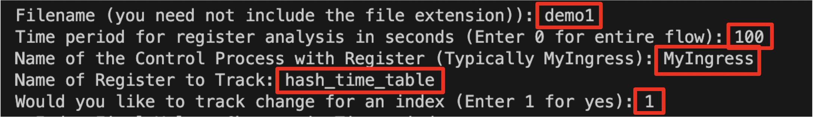

## Background
This project contains an implementation for an assistive tool that help with development with P4. The tool has the capabilities to parse log files and visualize/present changes that happen in registers over the course of time. It can output both the final register values after `k` seconds of running a flow and the corresponding change of values for any index of the register in the first `k` seconds. 

I added the ability to partially parse log files by time periods due to the following reasons: \n
1) The change in values of registers can be very quick with registers being updated every few milliseconds in some scenarios. For instance, some of the generated log files for switches 1 and 6 exceeded 2 Gbs in Project 6 of this class. For those sizes, even my text-editor (VS-Code) struggles to smoothly load and traverse through the files. Also, that was only for a 300 second udp flow, the size would be even larger for larger flow times.

2) When looking for factors such as convergence, I felt it would be convenient to analyze and study the change in values of registers in different time periods. This debugging tool gives out the number of times an index was updated in a given time period to assist with detecting frequency of access. This could again be helpful in debugging Project 6 and finding the optimal values of factors such as `enqq_depth_threshold` by observing frequency of change in the random seed.

## Functionality

### Some Preliminaries
1. Here are some values for the inputs that the programs asks for, which will work with the given demo files: 

Demo Name |  Filename | Time Period | Control Process | Register Name | Would You like to Track Index
:-------------:|:-------------:|:------------:|:-------------:|:----:|:-------:
1 | demo1 | 0-3599 | MyIngress | hash_time_table, hash_flow_table | if yes 1
2 | demo2 | 0-3599 | MyIngress | hash_time_table, hash_flow_table, someimp_table | if yes 1
3 | demo3 | 0-3599 | MyIngress | someimp_table | if yes 1
large | demo_large | 1-3599 | MyEgress | clone_timestamp | if yes 1

2. The large demo file could not be uploaded to github due to github's 100mb file limit. Here's a drive link from where you can download the log file. Simply placing it in log folder should be enough for that test to work.

3. If you decide to track an index, once the register png/csv is generated and dataframe is printed out, you can enter any of the given indexes to generate a png/csv with detailed information about the change in the the values of that index in the given time period.

### Run The Debugger

1. Place `debugger.py` in the directory of any project using P4. The program assumes that the switch log files are available under `log/<filename.log>`

2. Once you run your topology and the desired flow of packets to generate the log files, you should execute the following command to start the debug assistance program. For the convenience of testing, I have added 3 demo log files in the log folder already. Also in step `7` you might have to download another log file to test for large sizes. 
```
python debugger.py
```

3. The program opens up with a menu where inputting `1` will start the register parsing process. After that you would like to input some information about the file and registers that you wish to parse through. In the image below, the values highlighted in red are the inputs that I provided to track the register `hash_time_table` from `MyIngress` for a period of `100` seconds since the last flow was ran on the log file with the relative path `log/demo1.log`. The `1` on  tracking indexes indicates that post the generation of the table containing the indexes and their corresponding values of the register at `100` seconds, I would like to track how the value changed for a particular register. More on this later. Additionally, due to reasons mentioned in the `Some Preliminaries` part 3, you should avoid inputting `0`, that is parsing through entire log files for massive files. Instead entering a larger value of time period (upto 3600) would establish the same job without running into a memory error.
 

4. The values entered above lead to 